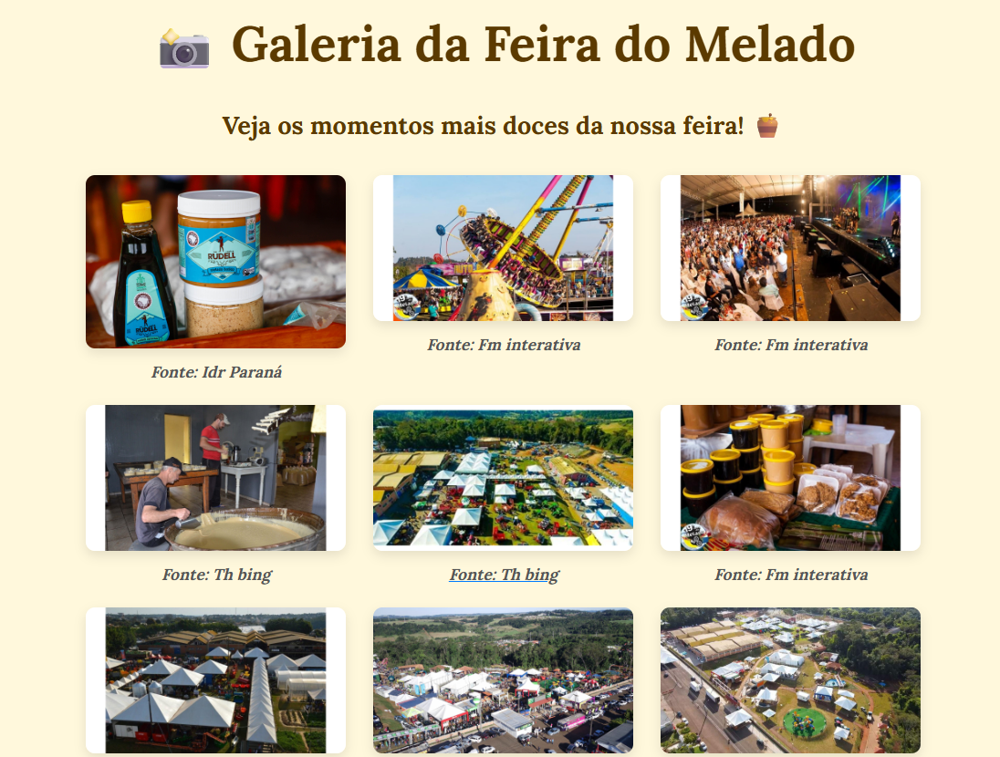

# Nome do Projeto

> **Feira do Melado de Capanema**: Um projeto digital criado para celebrar e divulgar a rica cultura e tradição da Feira do Melado no município de Capanema. Com o tema **"Festejando a Conexão Campo e Cidade"**, nosso objetivo é promover o evento, suas origens e seu impacto na comunidade local, conectando as raízes rurais à dinâmica urbana.

## Índice

- [Sobre o Projeto](#sobre-o-projeto)
- [Funcionalidades](#funcionalidades)
- [Como Rodar o Projeto](#como-rodar-o-projeto)
- [Tecnologias Utilizadas](#tecnologias-utilizadas)
- [Estrutura de Pastas](#estrutura-de-pastas)
- [Exemplos de Uso](#exemplos-de-uso)
- [Contribuição](#contribuição)
- [Licença](#licença)

---

## Sobre o Projeto

O **Projeto Feira do Melado** é uma plataforma digital desenvolvida com o propósito de **divulgar a tradição cultural da Feira do Melado de Capanema**. O projeto busca fortalecer os laços entre a cidade e o campo, mostrando como a feira representa um elo vital entre a produção rural local e o consumo urbano.

Com a temática **"Festejando a Conexão Campo e Cidade"**, a plataforma serve como um ponto de encontro virtual para os interessados na história, nas origens e nas curiosidades sobre a feira. Aqui, buscamos não só contar a história de um evento único, mas também celebrar as pessoas, os produtos e a cultura de Capanema.

## Funcionalidades

-O site oferece diversas funcionalidades para enriquecer a experiência do usuário:

- **Galeria de Imagens**: Uma coleção de fotos que ilustram a beleza e a diversidade da feira, além das tradições que a cercam.
- **História da Feira**: Uma seção dedicada a contar como a Feira do Melado começou e como ela cresceu ao longo dos anos.
- **Guias de Visitação**: Informações úteis sobre como visitar a feira, o que esperar e como aproveitar ao máximo esse evento cultural.
- **Informações de Contato**: Detalhes de como entrar em contato com os organizadores ou obter mais informações sobre o evento.

**Cadastro**: Aqui é onde os usuários iniciam no site e devem cadastrar seu email, se ele ja esta cadastrado é so clicar em entrar.

## Como Rodar o Projeto

O projeto é intuitivo e fácil de navegar. As principais seções são acessíveis a partir do menu principal, que oferece links diretos para:

1. **Sobre a Feira**: Descubra a história e a importância da Feira do Melado para a cidade de Capanema e suas tradições.
2. **Galeria de Imagens**: Explore uma série de fotos que capturam a essência do evento.
3. **história**: Conheça um pouco da história da nossa feira.
4. **Contato**: Caso tenha dúvidas ou queira saber mais sobre o evento.

Agora, abra o navegador e vá para `https://feira-do-melado-psi-ochre.vercel.app/index.html`.

## Tecnologias Utilizadas

Esse projeto foi desenvolvido utilizando as seguintes tecnologias:

HTML: Utilizado em todas as páginas do projeto, garantindo uma estrutura semântica e acessível. Cada guia do site é construída com HTML, o que facilita a organização e manutenção do conteúdo.

CSS: Usado para estilizar o site, garantindo um layout responsivo e visualmente agradável. O CSS é fundamental para dar vida ao design, aplicando cores, fontes, espaçamentos e animações nas páginas.

## Estrutura de Pastas

A estrutura do projeto segue o modelo abaixo:

GitHub: O projeto foi desenvolvido com o auxílio do editor de código online do GitHub, facilitando a colaboração entre os desenvolvedores, controle de versão e a integração contínua.

Vercel: Utilizamos o Vercel para o deployment do site. Com Vercel, conseguimos realizar o deploy de maneira ágil e automática, garantindo que as atualizações do projeto sejam publicadas rapidamente.

